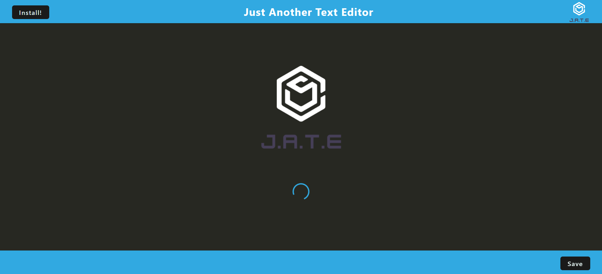
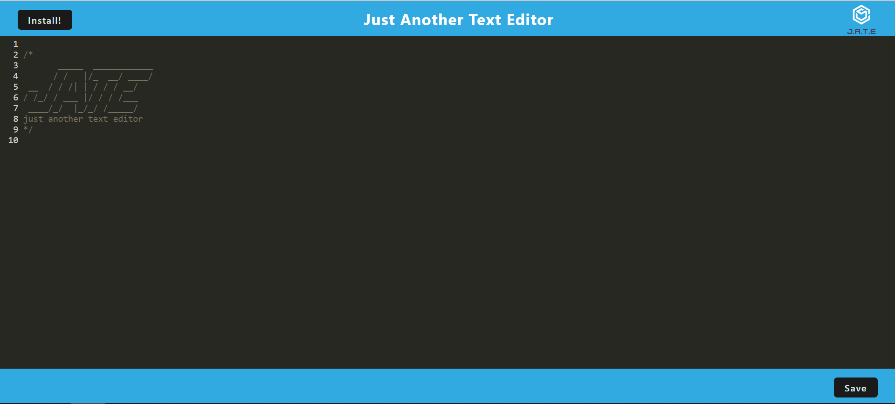

# Taylor's Text Editor
[](https://opensource.org/licenses/MIT)

## Table of Contents

- [Links](#links)
- [User Story](#user-story)
- [Acceptance Criteria](#acceptance-criteria)
- [Application Screenshot](#application-screenshot)
- [Installation](#installation)
- [Usage](#usage)
- [Contributing](#contributing)
- [License](#license)
- [Github](#github)

## Links

- [Github Project Repo](https://github.com/Bonee94/Taylors-Text-Editor)

- [Heroku Deployment](https://i-am-j-a-t-e.herokuapp.com/)

## User Story

```md
AS A developer
I WANT to create notes or code snippets with or without an internet connection
SO THAT I can reliably retrieve them for later use
```

## Acceptance Criteria

```md
GIVEN a text editor web application
WHEN I open my application in my editor
THEN I should see a client server folder structure
WHEN I run `npm run start` from the root directory
THEN I find that my application should start up the backend and serve the client
WHEN I run the text editor application from my terminal
THEN I find that my JavaScript files have been bundled using webpack
WHEN I run my webpack plugins
THEN I find that I have a generated HTML file, service worker, and a manifest file
WHEN I use next-gen JavaScript in my application
THEN I find that the text editor still functions in the browser without errors
WHEN I open the text editor
THEN I find that IndexedDB has immediately created a database storage
WHEN I enter content and subsequently click off of the DOM window
THEN I find that the content in the text editor has been saved with IndexedDB
WHEN I reopen the text editor after closing it
THEN I find that the content in the text editor has been retrieved from our IndexedDB
WHEN I click on the Install button
THEN I download my web application as an icon on my desktop
WHEN I load my web application
THEN I should have a registered service worker using workbox
WHEN I register a service worker
THEN I should have my static assets pre cached upon loading along with subsequent pages and static assets
WHEN I deploy to Heroku
THEN I should have proper build scripts for a webpack application
```

## Application Screenshot



## Installation

To install the necessary dependencies, run the following command:

- npm i

## Usage

- This application provides a place to write and save notes in a code editor format in your browser. Or it can be downloaded as an application to your desktop.

## Contributing

- No contributions allowed.

## License

- This project is licensed under the MIT License.
- https://www.mit.edu/~amini/LICENSE.md

## Github

You can find more of my work at [bonee94](https://github.com/bonee94).
